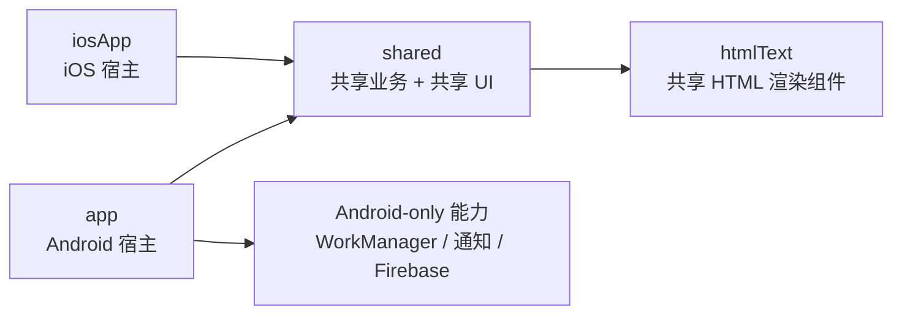

# Phase 4 收尾与收敛方案

## Summary

- 目标不是继续把页面从 `app` 搬到 `shared`，而是收掉已经完成迁移后残留的过渡噪音，固定平台边界，并为后续增量迁移提供统一模板。
- 当前仓库事实：
  - `SharedApp(...)`、`MainViewController()`、`V2App()`、`initKoin(...)` 都已形成稳定入口。
  - `app` 已基本收敛为 Android 宿主与 Android-only 初始化层，不再承载大块重复 Compose UI。
  - `shared` 已持有共享导航、共享 ViewModel、平台 handler 注入和大部分核心浏览能力。
  - `htmlText` 在 iOS 已具备可运行降级策略，但仍需通过文档把“支持 / 降级 / 不支持”说清楚。
- 本阶段只做收尾，不引入新架构决策：
  - 不替换导航栈
  - 不重命名共享根入口
  - 不扩大 iOS v1 范围
  - 不把 Android-only 能力继续下沉到 `commonMain`

## 模块职责图

- `app`
  - 负责 Android `Application`、`MainActivity`、flavor、通知权限、WorkManager、Firebase 等 Android 独占启动逻辑。
  - 保留 `V2App()` 薄壳，作为 Android 宿主包装层，不再承载共享业务实现。
- `shared`
  - 负责共享导航、共享状态、共享 ViewModel、Repository / UseCase、平台 handler 抽象与 Compose Multiplatform UI。
  - 负责导出 `SharedApp(...)` 与 `MainViewController()` 需要的共享装配能力。
- `htmlText`
  - 负责独立 KMP HTML 渲染能力。
  - 不依赖 `shared`，通过参数接收外链与降级动作，避免形成循环依赖。
- `iosApp`
  - 负责 SwiftUI / UIKit 宿主与 Xcode 工程。
  - 根页面只承载 `MainViewController()`，不自行实现业务逻辑。

## 平台能力接口清单

- `AppPlatformHandlers`
  - 共享 UI 的平台交互入口，聚合外链打开、分享、图片保存、设置跳转、通知状态查询。
  - 仅面向 UI 行为，不承担登录、网络、持久化等业务职责。
- `PlatformCapabilities`
  - 只表达 UI 门禁和降级开关。
  - 当前固定为 `supportsAutoCheckIn` 与 `supportsEmbeddedYouTube` 两个能力位，不继续扩成行为型总开关。
- `AutoCheckInScheduler`
  - 供 `MainViewModel` 编排自动签到平台行为。
  - Android 提供真实调度实现；iOS 保持 no-op。
- `WebViewProxyController`
  - 供 `MainViewModel` 同步代理设置到平台 WebView 侧。
  - Android 提供真实实现；iOS 保持 no-op。
- `PlatformContext`
  - 仅保留给 DataStore 等少量平台构造场景。
  - 不再作为共享逻辑继续扩散的通用入口，新增平台差异优先走明确接口。

## iOS v1 功能矩阵

### 已支持

- 浏览首页、节点、主题、用户、搜索
- 登录流程与共享回跳
- 外链跳转
- 分享主题 / 用户 / 链接
- 图片查看与通过系统分享面板保存图片链接

### 降级支持

- 内嵌 YouTube：
  - Android 支持内嵌播放
  - iOS v1 显示说明文案并提供“在浏览器打开”
- 通知设置入口：
  - Android 区分应用设置与通知设置
  - iOS 统一跳到系统应用设置页

### 不支持

- 自动签到后台调度
- Android 风格 WebView 代理链路
- Firebase Analytics / Crashlytics
- 复杂 WebView 容器交互与 Android 内部浏览器等价能力

## 新页面迁移模板

- 页面层：
  - 页面 Composable 优先放入 `shared/commonMain`
  - 页面只依赖共享状态、共享事件和平台抽象，不直接触碰 Android / iOS API
- ViewModel 层：
  - 新增或迁移 ViewModel 时，同步确认其平台依赖是否应抽成接口注入
  - 行为型平台差异不要塞进 `PlatformCapabilities`
- 导航层：
  - 补路由常量、参数解析、`navigateToXxx(...)` 扩展和 `SharedAppNavGraph` 挂载
  - 外链统一走 `AppNavigationAction.External` 或 `AppPlatformHandlers`
- DI 层：
  - 共享依赖进入 `shared` 的公共模块
  - 平台实现只放到各自 `platformModule`
- 平台差异：
  - 明确标注“完全共享 / 降级支持 / 不支持”
  - iOS 暂不支持时，必须提供显式 UI 文案或替代动作，不能静默失效
- 验收项：
  - `shared` 相关测试通过
  - Android 编译通过
  - iOS Simulator 编译通过
  - 涉及平台差异的显隐、降级或 no-op 行为有对应回归验证
