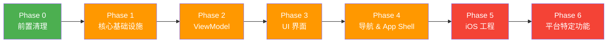

# V2compose → Compose Multiplatform 迁移计划

## 项目概况

| 指标 | 数据 |
|------|------|
| app 模块 Kotlin 文件 | 138 个，~15,226 行 |
| shared 模块 Kotlin 文件 | 101 个，~4,323 行 |
| htmlText 模块 | 已完成 KMP 迁移 |
| 已迁移到 shared | 网络层(部分)、Repository、DataStore、Paging、Bean |
| 待迁移 | UI 层(80+ 文件)、ViewModel(22 个)、导航、DI、Theme、UseCase |

## 迁移进度总览



---

## Phase 0: 前置清理（消除遗留依赖）

> [!IMPORTANT]
> 这个阶段的目标是消除 Android-specific 的技术债务，为后续迁移扫清障碍。所有改动仅在 `app` 模块内部进行，不影响已有功能。

### 0.1 清除 Moshi 依赖

| 文件 | 动作 |
|------|------|
| [KoinModules.kt](file:///Users/cooaer/Developer/myself/V2compose/app/src/main/java/io/github/v2compose/di/KoinModules.kt) | 移除 `Moshi` 单例注入 |
| [NewReleaseDialog.kt](file:///Users/cooaer/Developer/myself/V2compose/app/src/main/java/io/github/v2compose/ui/common/NewReleaseDialog.kt) | Moshi → kotlinx.serialization |
| [SettingsViewModel.kt](file:///Users/cooaer/Developer/myself/V2compose/app/src/main/java/io/github/v2compose/ui/settings/SettingsViewModel.kt) | 同上 |
| [build.gradle.kts (app)](file:///Users/cooaer/Developer/myself/V2compose/app/build.gradle.kts) | 移除 moshi 依赖 |

### 0.2 清除 Jsoup 残留

V2EX HTML 解析已迁移至 ksoup (KMP)，需移除 `org.jsoup` 的最后残留：

| 文件 | 动作 |
|------|------|
| [CfEmailUtils.kt](file:///Users/cooaer/Developer/myself/V2compose/app/src/main/java/io/github/v2compose/util/CfEmailUtils.kt) | jsoup → ksoup |
| [TextEditor.kt](file:///Users/cooaer/Developer/myself/V2compose/app/src/main/java/io/github/v2compose/ui/common/TextEditor.kt) | jsoup → ksoup |
| [build.gradle.kts (app)](file:///Users/cooaer/Developer/myself/V2compose/app/build.gradle.kts) | 移除 jsoup 依赖 |

### 0.3 重构 BaseViewModel — 消除 AndroidViewModel

当前 [BaseViewModel](file:///Users/cooaer/Developer/myself/V2compose/app/src/main/java/io/github/v2compose/ui/BaseViewModel.kt) 继承 `AndroidViewModel`，5 个 ViewModel 依赖它来获取 `Context`。

**方案**: 改为继承 `ViewModel()`，通过 Koin 注入替代 `Application` 引用：

```kotlin
// Before
open class BaseViewModel(application: Application) : AndroidViewModel(application) {
    val context: Context get() = getApplication<App>().applicationContext
    suspend fun updateSnackbarMessage(@StringRes valueResId: Int) {
        _snackbarMessage.emit(context.getString(valueResId))
    }
}

// After — 消除 Android 依赖
open class BaseViewModel : ViewModel() {
    private val _snackbarMessage = MutableStateFlow<String?>(null)
    val snackbarMessage: StateFlow<String?> = _snackbarMessage
    suspend fun updateSnackbarMessage(value: String?) { _snackbarMessage.emit(value) }
}
```

受影响的 ViewModel：
- `MainViewModel`, `MineViewModel`, `NodeViewModel`, `TopicViewModel`, `UserViewModel`
- 这些 ViewModel 中使用 `context` 的地方需要改为通过 Koin 注入的 `StringProvider` 或直接传入字符串

### 0.4 Markwon 替代方案评估

[Markwon](https://github.com/noties/markwon) 是 Android-only 的 Markdown 渲染库。

**方案选项**：
1. **A) [multiplatform-markdown-renderer](https://github.com/mikepenz/multiplatform-markdown-renderer)** — 纯 Compose Multiplatform 实现，API 类似
2. **B) 自定义 Compose Text 渲染** — 基于已有的 `htmlText` 模块扩展

> [!WARNING]
> 需确认 Markwon 在 app 中的实际使用范围和复杂度，再决定方案。

---

## Phase 1: 核心基础设施

> [!IMPORTANT]
> 此阶段建立跨平台的基础设施层，使后续 UI/ViewModel 迁移可以直接引用这些共享设施。

### 1.1 字符串资源迁移 — Android R.string → Compose Resources

当前状态：UI 层广泛使用 `R.string.*`、`stringResource()`、`BaseScreenState.showMessage(@StringRes)`。

**方案**：使用 JetBrains Compose Resources（`compose.components.resources`，shared 模块已依赖）：

| 步骤 | 说明 |
|------|------|
| 1 | 在 `shared/src/commonMain/composeResources/values/strings.xml` 创建共享字符串定义 |
| 2 | 使用 `org.jetbrains.compose.resources.stringResource(Res.string.xxx)` 替代 `androidx.compose.ui.res.stringResource(R.string.xxx)` |
| 3 | 对于 ViewModel 层需要的字符串，通过 `StringProvider` 接口 + expect/actual 提供 |

> 预计涉及文件：50+ 个 UI 文件需要批量替换。

### 1.2 Theme 层跨平台化

[Theme.kt](file:///Users/cooaer/Developer/myself/V2compose/app/src/main/java/io/github/v2compose/ui/theme/Theme.kt) 当前依赖：
- `android.os.Build.VERSION`（判断 Dynamic Color 支持）
- `LocalContext.current`（获取 Context 用于 Dynamic Color）
- `Activity.window`（设置状态栏样式）

**方案**：

```
shared/src/
├── commonMain/.../theme/
│   ├── Color.kt          # 不变，纯颜色定义
│   ├── Type.kt           # 不变，纯字体定义
│   └── Theme.kt          # 通用 ThemeWrapper，调 expect fun
├── androidMain/.../theme/
│   └── PlatformTheme.kt  # Dynamic Color + Status Bar 的 Android 实现
└── iosMain/.../theme/
    └── PlatformTheme.kt  # iOS 状态栏适配实现
```

### 1.3 BaseScreenState 跨平台化

[BaseScreenState](file:///Users/cooaer/Developer/myself/V2compose/app/src/main/java/io/github/v2compose/ui/BaseScreenState.kt) 依赖 `android.content.Context` 用于 `getString()`。

**方案**：移除 Context 依赖，`showMessage()` 只接受 `String` 参数。调用方在 Composable 层通过 `stringResource()` 获取字符串后传入。

### 1.4 网络层完全迁移 — OkHttp → Ktor

app 模块中仍存在完整的 OkHttp 网络栈：

| 当前文件 | 迁移动作 |
|----------|----------|
| [OkHttpFactory.kt](file:///Users/cooaer/Developer/myself/V2compose/app/src/main/java/io/github/v2compose/network/OkHttpFactory.kt) | 逻辑迁入 shared 的 `V2Client.kt` 配置中，使用 Ktor 等价实现 |
| [V2ProxySelector.kt](file:///Users/cooaer/Developer/myself/V2compose/app/src/main/java/io/github/v2compose/network/di/V2ProxySelector.kt) | 迁移至 shared，基于 Ktor ProxyConfig expect/actual |
| WebkitCookieManager (app 中) | 迁移至 shared androidMain，iOS 使用 NSHTTPCookieStorage |

**关键细节**：
- `ConfigInterceptor` → Ktor `HttpSend` plugin 或 `install(DefaultRequest)`
- `RedirectInterceptor` → Ktor `HttpRedirect` plugin 配置
- Cookie 管理 → Ktor `HttpCookies` plugin + 平台持久化

### 1.5 DI 层重构

当前 [KoinModules.kt](file:///Users/cooaer/Developer/myself/V2compose/app/src/main/java/io/github/v2compose/di/KoinModules.kt) 是一个 237 行的巨型文件，包含所有 Android 依赖。

**目标结构**：

```
shared/src/commonMain/.../di/
├── Koin.kt              # initKoin() ← 已存在
├── SharedModule.kt      # [NEW] 网络、Repository、DataStore、UseCase
└── ViewModelModule.kt   # [NEW] 所有 ViewModel 注册

shared/src/androidMain/.../di/
└── PlatformModule.kt    # [NEW] ImageLoader、平台引擎、CookieManager

shared/src/iosMain/.../di/
└── PlatformModule.kt    # [NEW] 同上的 iOS 实现

app/.../di/
└── KoinModules.kt       # [MODIFY] 仅保留 Android 专有（WorkManager、Firebase）
```

### 1.6 ImageLoader 跨平台化

Coil 3 已支持 KMP。当前 ImageLoader 在 app 的 KoinModules 中配置，使用了 `android.content.Context`。

**方案**：将 ImageLoader 配置迁移至 shared 模块，通过 `expect/actual` 提供平台 `PlatformContext`。GIF 解码器在 iOS 上使用 Coil 内置支持。

---

## Phase 2: ViewModel 迁移

> 将 22 个 ViewModel 从 `app` 迁移到 `shared/src/commonMain`。

### 2.1 ViewModel 分层迁移策略

按依赖复杂度分批迁移：

**第一批 — 纯业务逻辑（无 Android API 依赖）**：

| ViewModel | 依赖 | 复杂度 |
|-----------|------|--------|
| HomeViewModel | 无 | ⭐ |
| NodesViewModel | NodeRepository | ⭐ |
| V2AppViewModel | AccountRepository | ⭐ |
| GalleryViewModel | StringDecoder | ⭐ |
| NewsViewModel | NewsRepository | ⭐⭐ |
| RecentViewModel | Repository + Paging | ⭐⭐ |
| SearchViewModel | Repository + Paging | ⭐⭐ |
| LoginViewModel | AccountRepository | ⭐⭐ |
| TwoStepLoginViewModel | AccountRepository | ⭐⭐ |
| GoogleLoginViewModel | AccountRepository | ⭐⭐ |
| WriteTopicViewModel | TopicRepository + NodeRepository | ⭐⭐ |
| AddSupplementViewModel | TopicRepository | ⭐⭐ |
| NotificationViewModel | AccountRepository + Paging | ⭐⭐ |
| MyTopicsViewModel | Paging | ⭐⭐ |
| MyFollowingViewModel | Paging | ⭐⭐ |
| MyNodesViewModel | AccountRepository | ⭐⭐ |
| SettingsViewModel | Multiple Repos | ⭐⭐ |

**第二批 — 依赖 BaseViewModel (需先完成 Phase 0.3)**：

| ViewModel | 额外 Android 依赖 | 复杂度 |
|-----------|-------------------|--------|
| MainViewModel | Application, WorkManager | ⭐⭐⭐ |
| MineViewModel | Application | ⭐⭐⭐ |
| NodeViewModel | Application | ⭐⭐⭐ |
| TopicViewModel | Application, Context | ⭐⭐⭐⭐ |
| UserViewModel | Application | ⭐⭐⭐ |

### 2.2 UseCase 迁移

| UseCase | Android 依赖 | 迁移方案 |
|---------|-------------|---------|
| CheckForUpdatesUseCase | 无 | 直接移入 shared |
| FixHtmlUseCase | Context, ImageLoader | 通过 expect/actual 抽象图片预取 |
| UpdateAccountUseCase | 无 | 直接移入 shared |
| CheckInUseCase | 无 | 直接移入 shared |
| LoadNodesUseCase | 无 | 直接移入 shared |

### 2.3 Koin ViewModel 注册替换

```kotlin
// Before (Android-specific)
import org.koin.androidx.viewmodel.dsl.viewModelOf
viewModelOf(::TopicViewModel)

// After (KMP)
import org.koin.core.module.dsl.viewModelOf
viewModelOf(::TopicViewModel)
```

---

## Phase 3: UI 界面迁移

> 将 80+ UI Composable 文件从 `app` 迁移到 `shared/src/commonMain`。这是工作量最大的阶段。

### 3.1 迁移前提

- [x] Phase 1 完成（字符串资源、Theme 已跨平台化）
- [x] Phase 2 完成（ViewModel 已在 shared）

### 3.2 UI 迁移分批计划

**第一批 — 通用组件 (`ui/common/`)**：

| 文件 | Android 依赖 | 迁移难度 |
|------|-------------|---------|
| CloseButton.kt | 无 | ⭐ |
| Divider.kt | 无 | ⭐ |
| LoadMore.kt | 无 | ⭐ |
| SimpleNode.kt | 无 | ⭐ |
| StateList.kt | 无 | ⭐ |
| ListDialog.kt | 无 | ⭐ |
| TextAlertDialog.kt | 无 | ⭐ |
| SegmentControl.kt | Build.VERSION | ⭐⭐ |
| PullToRefresh.kt | 无 | ⭐ |
| ScrollableTabRow.kt | 无 | ⭐ |
| TopicComposables.kt | Uri | ⭐⭐ |
| NodeComposables.kt | 无 | ⭐ |
| ScaffoldComposables.kt | 无 | ⭐ |
| LoginComposables.kt | 无 | ⭐ |
| HtmlComposables.kt | Context | ⭐⭐ |
| HtmlAlertDialog.kt | 无 | ⭐ |
| GalleryImage.kt | 无 | ⭐ |
| LazyPagingItemsWorkaround.kt | 无 | ⭐ |
| NewReleaseDialog.kt | Uri | ⭐⭐ |
| SelectNode.kt | 无 | ⭐ |
| AutoFillModifier.kt | android.* | ⭐⭐⭐ (需 expect/actual 或 iOS 降级) |
| TextEditor.kt | Jsoup, Markwon | ⭐⭐⭐⭐ |
| Keyboard.kt | android.* | ⭐⭐⭐ (需 expect/actual) |

**第二批 — 功能界面**：

| 界面模块 | 文件数 | 主要 Android 依赖 | 迁移难度 |
|----------|-------|-------------------|---------|
| search/ | 3 | Navigation | ⭐⭐ |
| gallery/ | 3 | Navigation, Uri, Environment | ⭐⭐⭐ |
| login/ | 6 | Navigation, Context | ⭐⭐ |
| node/ | 4 | Navigation, Context | ⭐⭐ |
| user/ | 5 | Navigation, Context | ⭐⭐ |
| supplement/ | 4 | Navigation | ⭐⭐ |
| write/ | 4 | Navigation | ⭐⭐ |

**第三批 — 核心界面（最复杂）**：

| 界面模块 | 文件数 | 主要 Android 依赖 | 迁移难度 |
|----------|-------|-------------------|---------|
| main/ | 16 | Navigation, Context, WorkManager | ⭐⭐⭐ |
| topic/ | 7 | Navigation, Context, 复杂交互 | ⭐⭐⭐⭐ |
| settings/ | 5 | WorkManager, Permissions | ⭐⭐⭐⭐ |

**第四批 — 平台特定界面（保留在 app 或 expect/actual）**：

| 界面模块 | 原因 |
|----------|------|
| webview/ | compose-webview-multiplatform 已支持 KMP，但 V2exRequestInterceptor 需要 expect/actual |
| theme/ | 需要 expect/actual (Phase 1 已处理) |

### 3.3 关键 API 替换清单

| Android API | KMP 替代 |
|-------------|---------|
| `android.net.Uri` | `io.ktor.http.Url` 或自定义 `UriParser` |
| `android.content.Context` | `PlatformContext` expect/actual |
| `android.util.Log` | `KLogger`（已在 shared） |
| `R.string.*` | `Res.string.*`（Compose Resources） |
| `stringResource(R.string.*)` | `stringResource(Res.string.*)` |
| `LocalContext.current` | `LocalPlatformContext.current` 或移除 |
| `android.content.Intent` | `expect fun shareText()`, `expect fun openUrl()` |
| `android.os.Build.VERSION` | `expect val sdkVersion` 或条件编译 |
| `@Parcelize` | `kotlinx.serialization.Serializable` (导航参数) |
| `BackHandler` | JetBrains `BackHandler`（已支持 KMP） |

---

## Phase 4: 导航 & 应用壳层

### 4.1 把 NavigationGraph 迁入 shared

[V2AppNavGraph.kt](file:///Users/cooaer/Developer/myself/V2compose/app/src/main/java/io/github/v2compose/V2AppNavGraph.kt) — 使用 JetBrains Navigation Compose (已在 shared 依赖中)。

**前提**：Phase 3 完成后，所有 Screen Composable 可在 commonMain 访问。

### 4.2 V2AppState 跨平台化

[V2AppState.kt](file:///Users/cooaer/Developer/myself/V2compose/app/src/main/java/io/github/v2compose/V2AppState.kt) 的 Android 依赖：
- `android.content.Context` → 移除或 expect/actual
- `android.content.Intent` (mailto/sms/tel) → `expect fun launchExternalAction()`
- `android.net.Uri` → KMP Uri 工具
- `Environment.getExternalStoragePublicDirectory` → `expect fun saveImageToDisk()`
- `context.imageLoader` → 通过 Koin 注入

### 4.3 App 入口点

```
shared/src/commonMain/.../App.kt  → 共享 App Composable (Theme + NavHost)
app/.../MainActivity.kt           → Android 入口 (setContent { App() })
iosApp/.../MainViewController.kt  → iOS 入口
```

---

## Phase 5: iOS 工程搭建

### 5.1 项目结构

```
V2compose/
├── app/                    # Android 应用 (现有)
├── shared/                 # KMP 共享模块 (现有)
├── htmlText/               # KMP 共享模块 (现有)
├── iosApp/                 # [NEW] iOS 应用
│   ├── iosApp/
│   │   ├── iOSApp.swift
│   │   ├── ContentView.swift
│   │   └── Info.plist
│   └── iosApp.xcodeproj
└── build.gradle.kts
```

### 5.2 iOS 构建配置

1. 在 `settings.gradle.kts` 中无需额外改动（shared 模块已配置 iOS target）
2. 创建 Xcode 项目，引入 shared framework
3. 配置 CocoaPods 或 SPM（如果需要 iOS-native 依赖）

### 5.3 iOS expect/actual 实现清单

| expect 声明 | iOS actual 实现 |
|------------|----------------|
| `PlatformContext` | 已实现 ✅ |
| `Platform` | 已实现 ✅ |
| `DataStoreFactory` | 已实现 ✅ |
| `PlatformEngine` (Ktor) | 已实现 ✅ (Darwin) |
| `KLogger` | 已实现 ✅ |
| `TimeUtils` | 已实现 ✅ |
| `PlatformTheme` | 待实现 |
| `openUrl()` | 待实现 → `UIApplication.shared.open(url)` |
| `shareText()` | 待实现 → `UIActivityViewController` |
| `saveImageToDisk()` | 待实现 → `UIImageWriteToSavedPhotosAlbum` |
| `CookieManager` | 待实现 → `NSHTTPCookieStorage` |
| `ProxyConfig` | 待实现 → `CFNetworkCopySystemProxySettings` |
| `ImageLoader` | 待配置（Coil 3 已支持 iOS） |

---

## Phase 6: 平台特定功能

### 6.1 后台签到 — WorkManager / BGTaskScheduler

| 平台 | 实现 |
|------|------|
| Android | 保留 WorkManager (`CheckInWorker`) |
| iOS | `BGTaskScheduler` + `BGAppRefreshTaskRequest` |

**接口设计**：
```kotlin
// commonMain
expect class BackgroundTaskScheduler {
    fun scheduleCheckIn(intervalHours: Int)
    fun cancelCheckIn()
}
```

### 6.2 通知中心

| 平台 | 实现 |
|------|------|
| Android | 保留 `NotificationCenter` (NotificationManager) |
| iOS | `UNUserNotificationCenter` |

### 6.3 分析/崩溃上报

| 平台 | 实现 |
|------|------|
| Android Google | Firebase Crashlytics + Analytics (现有) |
| Android FOSS | NoOp (现有) |
| iOS | Firebase iOS SDK 或 NoOp |

### 6.4 浏览器打开

[Browser.kt](file:///Users/cooaer/Developer/myself/V2compose/app/src/main/java/io/github/v2compose/core/Browser.kt) — 使用 Custom Tabs。

```kotlin
// commonMain
expect fun openInBrowser(url: String)

// androidMain → Chrome Custom Tabs
// iosMain → SFSafariViewController 或 UIApplication.shared.open()
```

---

## User Review Required

> [!IMPORTANT]
> **以下几个设计决策需要你的确认**：

### 决策 1: Markwon 替换方案
Markwon 是 Android-only 的 Markdown 渲染库。目前用在 `TextEditor.kt` 中。
- **A**: 使用 [multiplatform-markdown-renderer](https://github.com/mikepenz/multiplatform-markdown-renderer) 替换
- **B**: 如果 Markdown 使用范围有限，暂时用 expect/actual 隔离，iOS 做简化实现

### 决策 2: OkHttp → Ktor 迁移时机
`app` 模块中 OkHttp 栈承担了 Cookie 管理、代理选择、拦截器等核心逻辑。
- **A**: 在 Phase 1 中一次性迁移到 Ktor（推荐，越早越好）
- **B**: 先保留 OkHttp 作为 Android Ktor 引擎（`ktor-client-okhttp` 已在用），逐步迁移拦截器逻辑

### 决策 3: SSJetpackProgressButton / toolbar-compose 替换
这两个是 Android-only 的 Compose UI 库：
- `SSJetPackComposeProgressButton`：进度按钮
- `toolbar-compose`：可折叠工具栏
- **方案**: 自行实现等价的 KMP Composable 组件（功能不复杂）

### 决策 4: YouTube Player
`youtube-player` 库是 Android-only。
- **A**: 使用 compose-webview-multiplatform 嵌入 YouTube iframe（两端统一）
- **B**: expect/actual 隔离，Android 用原生 Player，iOS 用 WKWebView

### 决策 5: 迁移顺序偏好
推荐按 Phase 0 → 1 → 2 → 3 → 4 → 5 → 6 顺序执行。
- 是否有特定功能/界面希望优先迁移？
- 是否希望某些 Android-only 功能在 iOS 上暂时不支持？

---

## Verification Plan

### 每个 Phase 完成后

1. **编译验证**：`./gradlew :shared:compileKotlinIosSimulatorArm64` 确保 iOS target 编译通过
2. **Android 回归测试**：`./gradlew :app:assembleFossDebug` 确保 Android 构建不受影响
3. **Unit Test**：运行现有测试确保无回归
4. **Git Commit**：每个 Phase 完成后提交

### Phase 5 完成后

1. 在 iOS 模拟器上运行应用
2. 验证核心页面渲染和交互
3. 网络请求正常
4. 数据持久化正常

### 最终验证

1. Android + iOS 双端完整功能回归
2. 性能对比测试（启动时间、列表滚动流畅度）
